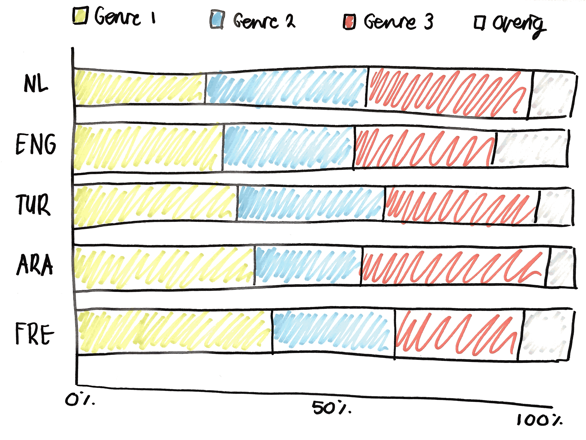

# Functional Programming

## To-Do

## Onderzoek

Aan de hand van de data uit de [API](https://zoeken.oba.nl/api/v1/) van de [OBA](https://www.oba.nl) heb ik vragen opgesteld.

### Vragen

Ik had graag willen onderzoeken wat de invloed van de komst van internationale studenten (in Amsterdam) is op de collectie van de OBA. Voor deze data had ik in ieder geval de volgende keys nodig uit de API: `target-audience`, `language`, `genre` en `import-time`.

Probleem met deze vraag:

- er is niet één `genre` met alle educatieve boeken. Het is teveel werk om uit te zoeken welke boeken in het genre onderwijs zouden kunnen vallen.
- de `import-time` van de artikelen niet erg betrouwbaar. Van bijna elk artikel is de import-time: `2017-07-17`.

#### Uiteindelijke onderzoeksvraag

Daarom heb ik mijn onderzoeksvraag verandert naar: Wat is de verhouding van de genres per taal?
Voor deze vraag heb ik de volgende keys nodig: `language`, `format-type`, `genre.`

Deelvragen:

- Van welke talen heeft de OBA boeken? Van welke taal zijn de meeste boeken?
- Wat zijn de grootste genres binnen een taal?
- Is er een verschil in de verdeling tussen de genres van buitenlandstalige boeken?
- Is er een verschil in de verdeling tussen de genres voor buitenlandstalige boeken en Nederlandstalige boeken?

#### Hypotheses

Ik verwacht vooral dat er een verschil zal zijn in de genres tussen Nederlandstalige en buitenlandstalige boeken. Ik verwacht bijvoorbeeld dat bepaalde genres als `islamitisch-milieu`, `streek-boeren-verhaal` en `homofiel-thema` niet in alle talen even populair zullen zijn. En dat bepaalde genres zelfs in bepaalde talen niet eens voorkomen in de OBA.

## Data ophalen

Vanuit het [node-oba-api](https://github.com/rijkvanzanten/node-oba-api) pakketje van Rijk ben ik begonnen met het ophalen van data.

Om van een taal alle boeken per genre op te halen schreef ik twee `.get` requests op de endpoints `search` en `refine`.

Via het endpoint `search` worden alle artikelen opgehaald die het `format:book` hebben, alle **boeken** dus.

```javascript
client.get(
  // vraag alle boeken op
  "search",
  {
    q: "format:book",
    librarian: true,
    refine: true
  },
  "title"
);
```

Via het endpoint `refine` wordt de facet informatie opgehaald over alles vanuit **boeken** van een **bepaalde taal**. Dit request geeft in o.a. het genre facet de aantallen per genre aan voor alle talen.

```javascript
selectedRctx.forEach(function(selectedRctx) {
  client
    .get("refine", {
      rctx: selectedRctx,
      count: 100
    })
    .then(response => JSON.parse(response).aquabrowser)
    .then(response => {
      var genreFacet = getGenreFacet(response);
    });
});
```

Met `getGenreFacet(response)` haal ik de benodigde data uit de het facet genre op. De data wordt opgeslagen in het bestand [data.json](https://github.com/sterrevangeest/functional-programming/blob/master/data.json).

Tijdens het ophalen van de data vond het lastig om in te schatten hoe ik de data het beste in kon structureren. Hier heb ik dan ook veel tijd aan besteed voordat ik aan D3 begon. Terwijl toen ik in D3 begon, ik ontdekte dat ik mijn data liever nog weer anders had willen structureren. Wat ik volgende keer meeneem

### Functional Programming

> "Functional programming is a language that focuses on the computation of pure functions. [The Medium](https://medium.com/@sho.miyata.1/the-object-oriented-programming-vs-functional-programming-debate-in-a-beginner-friendly-nutshell-24fb6f8625cc)"

Ik moet zeggen dat ik tijdens het programmeren een beetje vergat dat ik bezig was met functioneel programmeren. Maar als ik achteraf kijk naar mijn code denk ik dat ik onbewust wel functioneel geprogrammeerd heb.

Bijvoorbeeld:

> "They do not alter the data that was passed into them. We only want to describe how the input will be changed."

In mijn functie `getGenreFacet(response)` haal ik data op uit de API en herstructureer dit, maar verander de data niet.

### De datavisualisatie

Dit is een schets van hoe ik wil dat de datavisualisatie er ongeveer uit komt te zien:


Bekijk mijn datavisualisatie op [Observable](https://beta.observablehq.com/@sterrevangeest/functional-programming).

Hoe mijn datavisualisatie er nu uit ziet is nog lang niet wat ik had willen bereiken, zoals bijvoorbeeld de schets hierboven. Ik heb veel naar voorbeelden gekeken zoals: [D3 Stacked Normalized Horizontal Bar Chart](https://beta.observablehq.com/@mbostock/d3-stacked-normalized-horizontal-bar-chart), [D3 Stacked Horizontal Bar Chart](https://beta.observablehq.com/@mbostock/d3-stacked-horizontal-bar-chart) en [Stacked bar chart](https://beta.observablehq.com/@miralemd/picasso-js-stacked-bar-chart).

Omdat de data van deze voorbeelden op een hele andere manier is ingedeeld vond ik het niet makkelijk om met mijn eigen data een Stacked Bar Chart te maken.

### Dank voor:

De [Cheatsheet](https://github.com/DanielvandeVelde/functional-programming#cheatsheet) van Daniel.
Het [node-oba-api](https://github.com/rijkvanzanten/node-oba-api) pakketje van Rijk.

## Extra bronnen

De volgende bronnen zal ik kunnen gebruiken als ik verder onderzoek wil doen naar dit onderwerp:

Internationalisering op economisch gebied: [Nederland in Europese top economische internationalisering](https://www.cbs.nl/nl-nl/achtergrond/2014/38/nederland-in-europese-top-economische-internationalisering)

De meerwaarde van internationalisering in het onderwijs: [De meerwaarde van internationalisering | Nieuwsbericht | Rijksoverheid.nl](https://www.rijksoverheid.nl/actueel/nieuws/2018/06/04/de-meerwaarde-van-internationalisering)

Innovatie en internationalisering, omdat “innovatieve bedrijven
zijn doorgaans vaker internationaal georiënteerd”: [Innovatie en internationalisering](https://www.cbs.nl/nl-nl/achtergrond/2018/13/innovatie-en-internationalisering)
